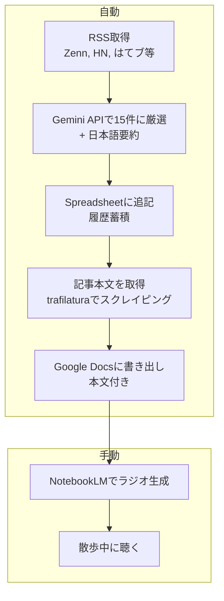

# news-pipeline

RSSで技術ニュースを収集し、LLMで自分の興味に合う記事を厳選するパイプライン。

厳選した記事をGoogle Spreadsheetに蓄積し、NotebookLMのソースにしてラジオ形式で聴く。散歩中に自分専用の技術ニュースラジオを聴くための仕組み。

## 仕組み



1. **RSS取得** — feeds.yamlに登録したフィードから24時間以内の記事を収集
2. **LLMで厳選** — profile.yamlの興味・除外基準をもとに、Gemini APIが15件に絞り込んで日本語要約をつける
3. **Spreadsheet追記** — 日付・カテゴリ・タイトル・URL・要約・ソースを1行1記事で蓄積
4. **記事本文を取得** — 厳選された記事のURLからtrafilaturaで本文を抽出（本文が取れなかった記事はスキップ）
5. **Google Docs書き出し** — 本文が取得できた記事をカテゴリ別に構造化してGoogle Docsに上書き（タイトル・URL・本文）
6. **NotebookLMでラジオ生成**（手動）— Google DocsをNotebookLMに追加し、音声を生成
7. **聴く**（手動）— 生成されたラジオを散歩中に聴く

## Forkして自分用に調整する

LLMがprofile.yamlの設定をもとに記事を選別するので、`interests`と`exclude`を自分に合わせて書き換えるだけで厳選の精度が変わる。このリポジトリをForkして、2つのファイルを編集すれば自分専用のパイプラインになる。

**`config/feeds.yaml`** — 情報源の追加・変更

```yaml
feeds:
  - name: "Zenn - トレンド"    # フィード名（Spreadsheetのソース列に表示）
    url: "https://zenn.dev/feed" # RSSフィードのURL
    lang: "ja"                   # 記事の言語（en / ja）
  # 自分の読みたいRSSフィードを追加
```

**`config/profile.yaml`** — 自分の興味・嗜好を定義

```yaml
role: "フルスタックエンジニア（Ruby, TypeScript, React）"  # LLMに伝える自分の職種・スキル
articles_per_day: 15  # 1日に厳選する記事数

interests:           # 優先的に選んでほしいジャンル（上ほど優先度が高い）
  - "AI/LLMの実用的な活用事例や新動向"
  - "開発ツール・ワークフロー改善"
  # 自分の興味を追加

exclude:             # 除外したいジャンル
  - "初心者向けチュートリアル"
  - "プレスリリースや広告色が強い記事"
  # 除外したいジャンルを追加
```

## クイックスタート

### 1. 依存インストール

[mise](https://mise.jdx.dev/) が必要。

```bash
mise install
mise run setup
```

### 2. envファイル作成

```bash
cp .env.example .env
```

### 3. Gemini APIキー取得

[Google AI Studio](https://aistudio.google.com/apikey) でAPIキーを取得し、`.env`に設定:

```
GEMINI_API_KEY=取得したAPIキー
```

### 4. GCPサービスアカウント作成

1. [Google Cloud Console](https://console.cloud.google.com/) でプロジェクトを作成
2. 「APIとサービス」→「ライブラリ」から **Google Sheets API** と **Google Docs API** を有効化
3. 「APIとサービス」→「認証情報」→「認証情報を作成」→「サービスアカウント」で作成（ロールの付与は不要。権限はSpreadsheetの共有設定で制御する）
4. 作成したサービスアカウントの「鍵」タブ →「鍵を追加」→「JSON」
5. ダウンロードしたJSONファイルをプロジェクトルートに `credentials.json` として配置

`.env`に追記:

```
GOOGLE_CREDENTIALS_PATH=./credentials.json
```

> **セキュリティに関する注意:** サービスアカウントキーのJSONファイルは有効期限がなく、漏洩すると第三者にGCPリソースを操作される恐れがある。`.gitignore`でリポジトリへの混入は防いでいるが、ローカルの取り扱いには注意すること。サービスアカウントの権限はGoogle Sheets APIのみに絞り、不要になったキーはGCPコンソールから削除する。より安全な方法として、ローカル実行なら`gcloud auth application-default login`によるADC認証、GitHub Actionsなら[Workload Identity連携](https://cloud.google.com/iam/docs/workload-identity-federation)がGoogleから推奨されている。

### 5. Spreadsheet準備

1. Google Spreadsheetを新規作成（シート名はデフォルトの「シート1」のままにする。英語環境では「Sheet1」になるため、その場合は`.env`に`SHEET_NAME=Sheet1`を追加する）
2. 1行目にヘッダーを入力: `日付 | カテゴリ | タイトル | URL | 要約 | ソース`
3. サービスアカウントのメールアドレス（credentials.json内の`client_email`）をSpreadsheetの共有に追加（編集者権限）
4. SpreadsheetのURLから`SPREADSHEET_ID`を取得（`/d/`と`/edit`の間の文字列）

`.env`に追記:

```
SPREADSHEET_ID=取得したSpreadsheetのID
```

### 6. Google Docs準備

NotebookLMのソースとして使うGoogle Docsを準備する。

1. Google Docsを新規作成
2. サービスアカウントのメールアドレスをDocsの共有に追加（編集者権限）
3. DocsのURLから`GOOGLE_DOC_ID`を取得（`/d/`と`/edit`の間の文字列）

`.env`に追記:

```
GOOGLE_DOC_ID=取得したDocsのID
```

## コマンド

```bash
mise tasks         # コマンド一覧を表示
mise run dry-run   # 厳選結果をターミナルに出力
mise run pipeline  # 全パイプライン実行（Spreadsheet + Google Docs出力）
mise run test      # テスト実行
```

## 使い方

### 毎朝の運用

`mise run pipeline`を実行する。初回実行時はRSS取得→LLM厳選→Spreadsheet追記→記事本文取得→Google Docs書き出しの全工程が走る。同じ日に再実行するとSpreadsheet追記はスキップされるが、記事本文の取得とGoogle Docsの書き出しは毎回実行される（Spreadsheetの今日分を読み取って上書きするため）。

Google Docsには記事の本文がそのまま載る。trafilaturaで各記事URLから本文を抽出しており、本文が取得できなかった記事はDocsに載らない。Spreadsheetには従来通り要約のみ蓄積される。

### NotebookLMでラジオを生成する

1. NotebookLMでノートブックを作成し、Google Docsをソースとして追加する（初回のみ）
2. パイプライン実行後、NotebookLMのソース一覧からGoogle Docsをクリックし、「クリックしてGoogleドライブと同期」を押す（Google Docs側が更新されてもNotebookLMは自動で同期しないため、手動で同期が必要）
3. 音声の概要を生成してラジオを聴く

### 手動で記事を追加したいとき

Spreadsheetに直接行を追加する（日付・カテゴリ・タイトル・URL・要約・ソース）。その後`mise run pipeline`を再実行すると、手動追加分も含めてGoogle Docsに反映される。

### dry-runで試す

`mise run dry-run`は厳選結果をターミナルに出力するだけ。SpreadsheetやGoogle Docsには書き込まない。

