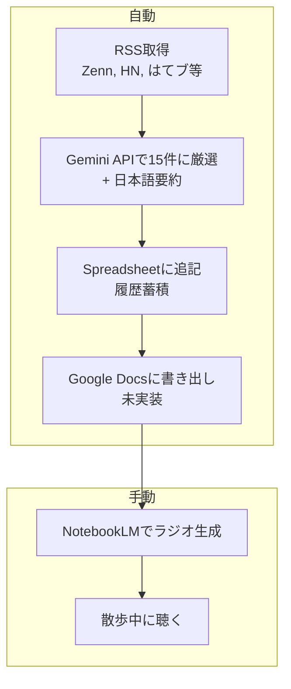

# news-pipeline

RSSで技術ニュースを収集し、LLMで自分の興味に合う記事を厳選するパイプライン。

厳選した記事をGoogle Spreadsheetに蓄積し、NotebookLMのソースにしてラジオ形式で聴く。散歩中に自分専用の技術ニュースラジオを聴くための仕組み。

## 仕組み



1. **RSS取得** — feeds.yamlに登録したフィードから24時間以内の記事を収集
2. **LLMで厳選** — profile.yamlの興味・除外基準をもとに、Gemini APIが15件に絞り込んで日本語要約をつける
3. **Spreadsheet追記** — 日付・カテゴリ・タイトル・URL・要約・ソースを1行1記事で蓄積
4. **Google Docs書き出し**（未実装）— 今日分の厳選結果をNotebookLMのソース用に書き出す
5. **NotebookLMでラジオ生成**（手動）— Google DocsをNotebookLMに追加し、音声を生成
6. **聴く**（手動）— 生成されたラジオを散歩中に聴く

## Forkして自分用に調整する

LLMがprofile.yamlの設定をもとに記事を選別するので、`interests`と`exclude`を自分に合わせて書き換えるだけで厳選の精度が変わる。このリポジトリをForkして、2つのファイルを編集すれば自分専用のパイプラインになる。

**`config/feeds.yaml`** — 情報源の追加・変更

```yaml
feeds:
  - name: "Zenn - トレンド"
    url: "https://zenn.dev/feed"
    lang: "ja"
  # 自分の読みたいRSSフィードを追加
```

**`config/profile.yaml`** — 自分の興味・嗜好を定義

```yaml
role: "フルスタックエンジニア（Ruby, TypeScript, React）"
articles_per_day: 15

interests:
  - "AI/LLMの実用的な活用事例や新動向"
  - "開発ツール・ワークフロー改善"
  # 自分の興味を追加

exclude:
  - "初心者向けチュートリアル"
  - "プレスリリースや広告色が強い記事"
  # 除外したいジャンルを追加
```

## クイックスタート

### 1. 依存インストール

[mise](https://mise.jdx.dev/) が必要。

```bash
mise install
mise run setup
```

### 2. Gemini APIキー取得

[Google AI Studio](https://aistudio.google.com/apikey) でAPIキーを取得。

```bash
cp .env.example .env
```

`.env`の`GEMINI_API_KEY`に取得したキーを設定。

### 3. GCPサービスアカウント作成

1. [Google Cloud Console](https://console.cloud.google.com/) でプロジェクトを作成
2. 「APIとサービス」→「ライブラリ」から **Google Sheets API** を有効化
3. 「APIとサービス」→「認証情報」→「認証情報を作成」→「サービスアカウント」で作成
4. 作成したサービスアカウントの「鍵」タブ →「鍵を追加」→「JSON」
5. ダウンロードしたJSONファイルをプロジェクトルートに `credentials.json` として配置

### 4. Spreadsheet準備

1. Google Spreadsheetを新規作成
2. 1行目にヘッダーを入力: `日付 | カテゴリ | タイトル | URL | 要約 | ソース`
3. サービスアカウントのメールアドレス（credentials.json内の`client_email`）をSpreadsheetの共有に追加（編集者権限）
4. SpreadsheetのURLから`SPREADSHEET_ID`を取得（`/d/`と`/edit`の間の文字列）

`.env`に追記:

```
SPREADSHEET_ID=取得したSpreadsheetのID
GOOGLE_CREDENTIALS_PATH=./credentials.json
```

## コマンド

```bash
mise tasks         # コマンド一覧を表示
mise run dry-run   # 厳選結果をターミナルに出力
mise run run       # 全パイプライン実行（Spreadsheet出力）
mise run test      # テスト実行
```
